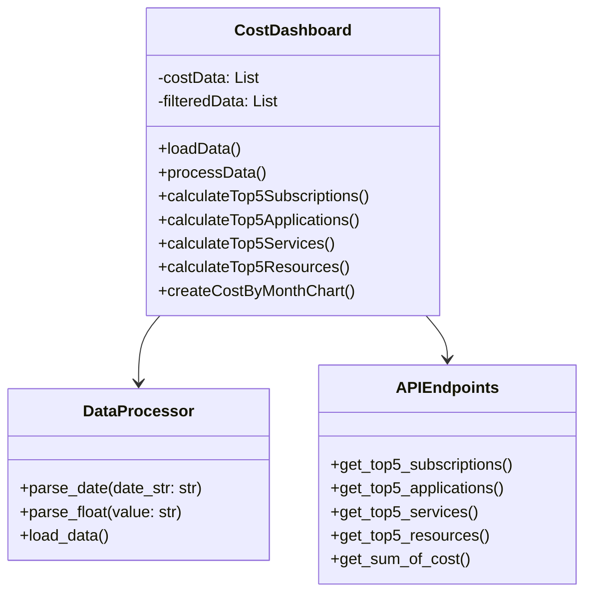
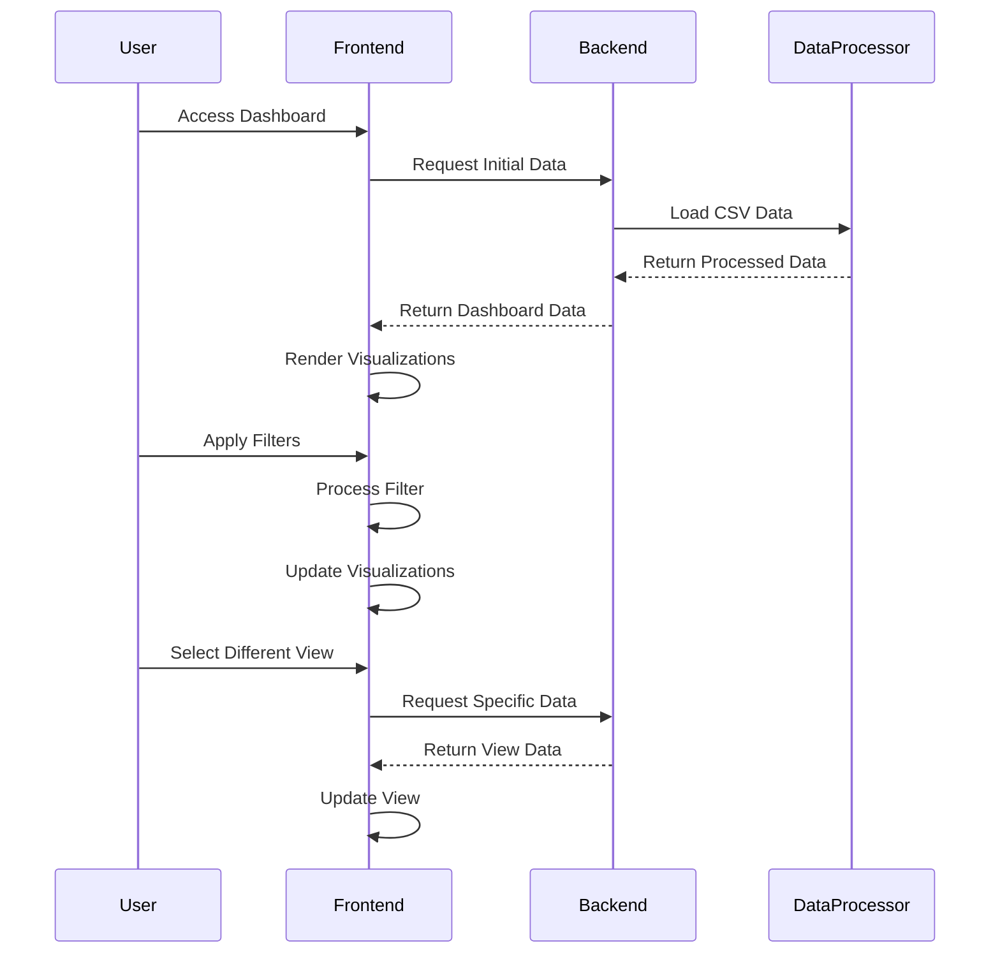
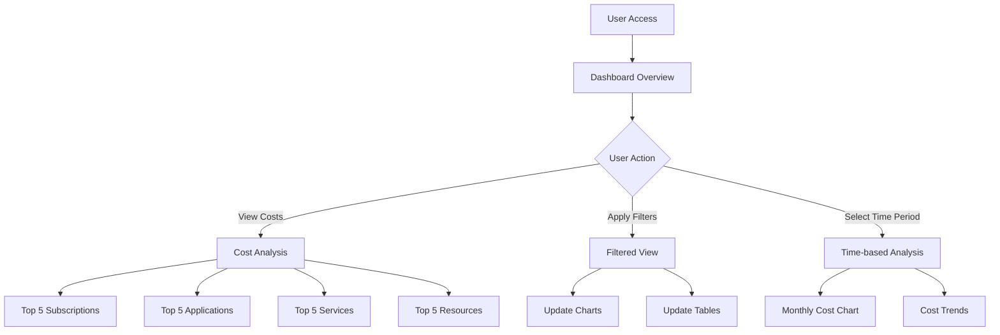

# Azure Cost Dashboard Documentation

## Architecture Overview

The Azure Cost Dashboard is a web application that provides visualization and analysis of Azure cost data. It uses a Flask backend for data processing and a Vue.js frontend for interactive visualizations.

## Class Diagram

## Sequential Diagram

## User Flow Diagram

## Technical Stack

- **Backend**:
  - Python 3.x
  - Flask Framework
  - CSV Data Processing
  
- **Frontend**:
  - Vue.js (via CDN)
  - Chart.js for visualizations
  - Tailwind CSS for styling
  
- **Data Format**:
  - CSV with fields:
    - SubscriptionId
    - ServiceName
    - ResourceGroupName
    - Cost
    - APPLICATION
    - SUBSCRIPTIONNAME
    - Other metadata fields

## API Endpoints

| Endpoint | Method | Description |
|----------|--------|-------------|
| `/api/cost-data` | GET | Retrieve all cost data |
| `/api/top5Subscriptions` | GET | Get top 5 subscriptions by cost |
| `/api/top5Applications` | GET | Get top 5 applications by cost |
| `/api/top5ServiceNames` | GET | Get top 5 services by cost |
| `/api/top5Resources` | GET | Get top 5 resources by cost |
| `/api/sumOfCost` | GET | Get cost summary by month |

## Data Flow

1. CSV data is loaded and processed by the Flask backend
2. Frontend requests data through API endpoints
3. Data is processed and filtered based on user selections
4. Visualizations are updated using Chart.js
5. User interactions trigger real-time updates

## Security Considerations

- Input validation on all API endpoints
- Data sanitization for CSV imports
- Error handling for malformed requests
- No sensitive data exposure in frontend
